# Meridian — E-Commerce Store

A full-stack, commercial-grade e-commerce application: customer storefront with Razorpay
Checkout, real inventory integrity, verified-purchase reviews, and a complete admin
back office. The first project in my 20-project curriculum that behaves like a real
production system — payments, transactions, webhooks, and CI/CD from day one.


## Screenshots / Demo

| Storefront | Razorpay Checkout |
|---|---|
|  | 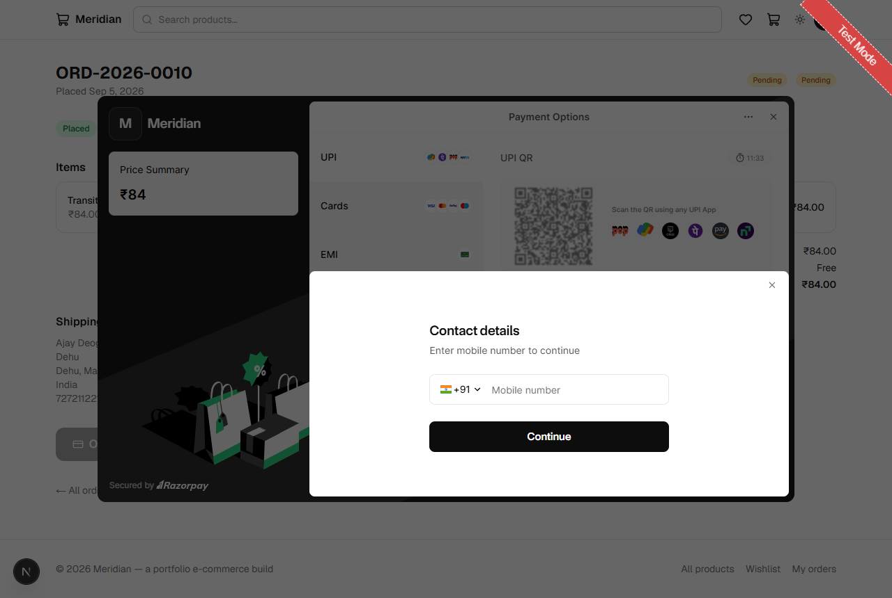 |

| Order confirmed | Admin dashboard |
|---|---|
| 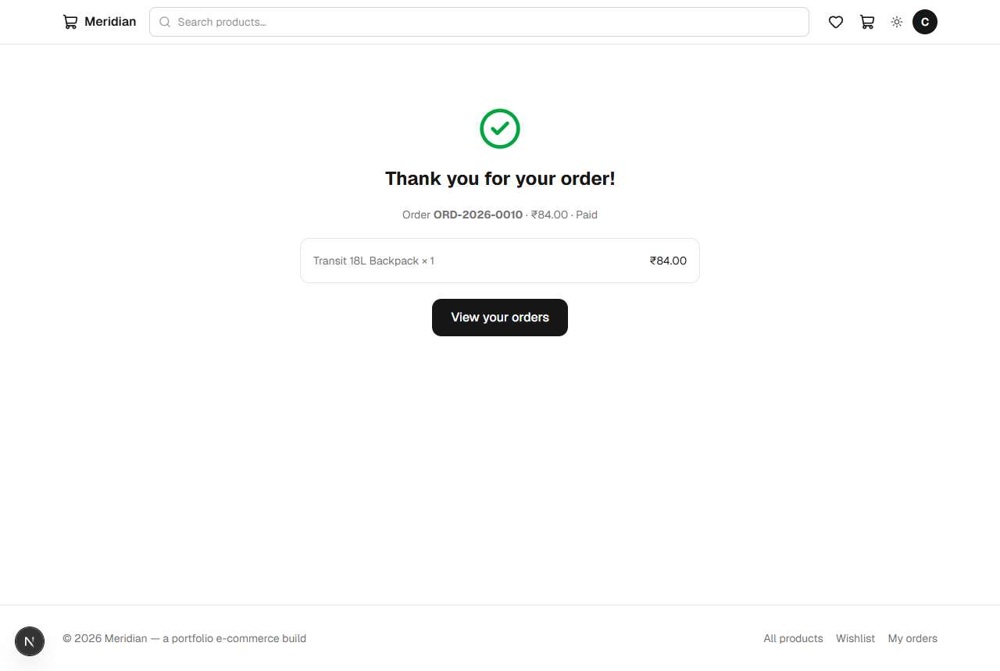 | 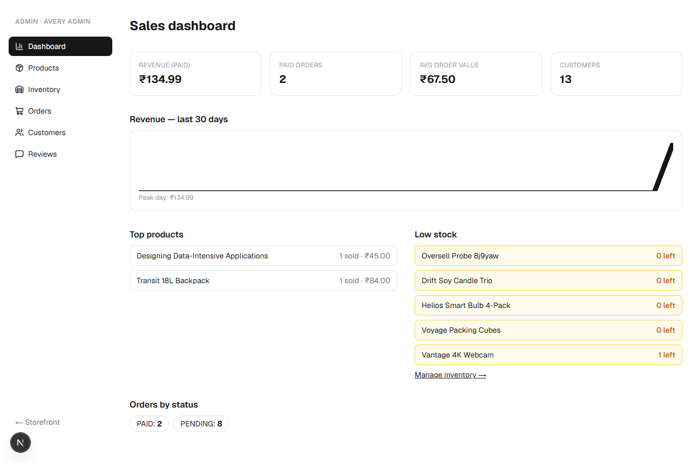 |

▶ **[30-second demo walkthrough](#13-demo)** — browse → cart → Razorpay payment (test card) → confirmation (GIF below).

## Table of Contents

1. [Problem](#1-problem)
2. [Features](#2-features)
3. [Tech Stack](#3-tech-stack)
4. [Architecture](#4-architecture)
5. [Database Schema](#5-database-schema)
6. [API Documentation](#6-api-documentation)
7. [Authentication Strategy](#7-authentication-strategy)
8. [Security Considerations](#8-security-considerations)
9. [Testing Strategy](#9-testing-strategy)
10. [Performance Considerations](#10-performance-considerations)
11. [Deployment Architecture](#11-deployment-architecture)
12. [Screenshots](#12-screenshots)
13. [Demo](#13-demo)
14. [What I Learned](#14-what-i-learned)
15. [Future Improvements](#15-future-improvements)
16. [Trade-offs & Design Decisions](#16-trade-offs--design-decisions)
17. [Scaling Strategy](#17-scaling-strategy)

## 1. Problem

A blog or a CRUD app doesn't teach you what a *commercial* application demands:

- **Money correctness** — every cent must be accounted for; historical orders must
  never change when a product price changes
- **Inventory integrity** — two buyers racing for the last unit must never both win
- **Payments** — accept real (test) money without ever trusting the client
- **Async fulfillment** — payments confirm out-of-band via webhooks; email confirms
  the order; every step must be idempotent because networks retry

This project solves all four while staying a portfolio-sized codebase.

## 2. Features

**Customer storefront**

- Browse / search / filter (category, price range) / sort (newest, price, rating)
  with cursor pagination
- Product detail: image gallery, compare-at pricing, live stock indicator,
  related products, sanitized rich descriptions
- Guest cart (localStorage) that merges into the DB cart on sign-in
- Wishlist with idempotent heart toggle
- Razorpay Checkout (modal) with server-computed totals and shipping rules
- Order history with status timeline; "pay again" for pending orders
- Verified-purchase reviews: one per user per product, aggregates updated transactionally

**Admin back office**

- Sales dashboard: revenue, paid orders, AOV, customers, 30-day revenue sparkline,
  top products, low-stock alerts
- Product CRUD (images via media picker, price in cents, DRAFT/ACTIVE/ARCHIVED)
- Inventory management with ±delta or absolute stock adjustments
- Order queue + detail with a server-enforced status machine
- Customer list with order count + lifetime value
- Review moderation (hide/restore/delete → aggregates recompute)

## 3. Tech Stack

| Layer | Choice | Notes |
|---|---|---|
| Framework | Next.js 16 (App Router) | Server components for all read paths |
| Language | TypeScript (strict) | |
| Styling | Tailwind CSS v4 | + `@tailwindcss/typography` |
| Database | Supabase Postgres | pooled 6543 runtime / direct 5432 migrations; local dev via Docker |
| ORM | Prisma 6 | Transactions + conditional updates for stock |
| Auth | NextAuth v4 (Credentials + JWT) | PrismaAdapter, `role` on token/session |
| Payments | Razorpay (Standard Checkout + webhooks) | test mode, INR |
| Email | Resend | graceful SKIPPED mode when unconfigured |
| Media | Cloudinary / S3 | one pluggable storage interface (ported from my blog-cms project) |
| Data fetching | TanStack Query v5 + Axios | |
| Validation | Zod | every write route |
| Testing | Vitest | unit + concurrency scripts |

## 4. Architecture

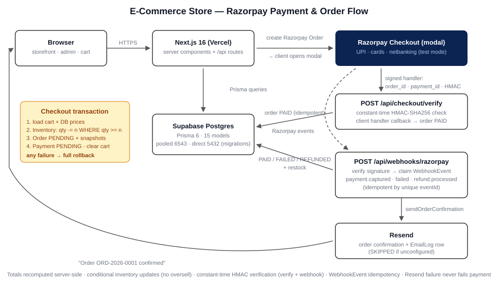

```
src/app/
├── (public)/            storefront — server-rendered, SEO-aware
│    ├── page.tsx         home: hero, categories, featured, new arrivals
│    ├── products/        listing + [slug] detail
│    ├── categories/[slug]/cart/checkout/wishlist/account/*
├── (auth)/              signin / signup
├── (admin)/admin/       dashboard, products, inventory, orders, customers, reviews
└── api/                 REST surface (see §6)
```

**Request flow — browse → cart → checkout → paid**

```
browse     Browser → server component → Prisma (Product+Category+Inventory)
cart       signed-in: POST /api/cart/items (validated vs stock) · guest: localStorage
checkout   POST /api/checkout/session
             prisma.$transaction:
               1. load cart + DB prices
               2. UPDATE Inventory SET qty = qty - n WHERE qty >= n   ← no oversell
               3. Order (PENDING) + OrderItem snapshots + Payment (PENDING)
               4. clear cart
           → Razorpay Order created → client opens the Checkout modal
payment    handler → POST /api/checkout/verify
             verify HMAC signature → order PAID → Resend email (EmailLog)
           Razorpay → POST /api/webhooks/razorpay (belt to the verify suspenders)
             verify signature → claim WebhookEvent (idempotency)
             payment.captured → order PAID (idempotent)
             payment.failed   → Payment FAILED (order stays PENDING for retry)
             refund.processed → order REFUNDED + restock
```

## 5. Database Schema

Full schema: [`prisma/schema.prisma`](prisma/schema.prisma) — 15 models.
ER diagram: [`docs/ER-diagram.svg`](docs/ER-diagram.svg).

Key design points:

- **Money is integer minor units everywhere** (`priceCents`, `subtotalCents`,
  `totalCents` — stored as cents/paise). Formatted only at the UI edge by
  `formatMoney()`. Razorpay natively uses paise, so DB amounts map 1:1 onto
  payment requests with zero conversion.
- **OrderItem snapshots** `productName`, `productSlug`, `unitPriceCents` — a later
  product edit or price change never rewrites order history.
- **Order carries a flat shipping snapshot** — later Address edits don't mutate orders.
- **Inventory is a separate 1:1 model** (`sku` unique, `lowStockThreshold`) with room
  for per-variant stock later.
- **WebhookEvent.eventId UNIQUE** is the webhook idempotency key.

Selected indexes:

| Table | Index | Why |
|---|---|---|
| Product | `(status, createdAt DESC)` | new arrivals + default sort |
| Product | `(categoryId, status)` | category pages |
| Product | `(status, priceCents)` | price sort/filter |
| CartItem | `(cartId, productId)` UNIQUE | idempotent add-to-cart |
| Order | `(userId, placedAt DESC)` | "my orders" |
| Order | `razorpayOrderId` UNIQUE | verify/webhook → order lookup |
| Review | `(productId, userId)` UNIQUE | one review per buyer |
| Review | `(productId, status, createdAt DESC)` | review lists |

## 6. API Documentation

Errors are normalized to `{ error: string }` (400/401/403/404/409/422/429/500).

| Method | Route | Guard |
|---|---|---|
| POST | `/api/auth/register` | public (rate-limited 5/min) |
| GET/POST | `/api/auth/[...nextauth]` | NextAuth credentials |
| GET | `/api/products?q&categoryId&minPrice&maxPrice&sort&cursor` | public (ACTIVE only) |
| GET | `/api/products/[slug]` | public (DRAFT/ARCHIVED → 404 unless ADMIN) |
| POST | `/api/products` | ADMIN |
| PATCH/DELETE | `/api/products/[id]` | ADMIN (DELETE archives; hard-delete only with no order refs) |
| GET | `/api/categories` · POST/PATCH/DELETE | public read · ADMIN write |
| GET/DELETE | `/api/cart` | signed-in |
| POST | `/api/cart/items` · PATCH/DELETE `/api/cart/items/[id]` | signed-in (stock-validated) |
| POST | `/api/cart/merge` | signed-in (guest cart merge) |
| GET | `/api/cart/guest?ids=` | public (guest cart hydration) |
| GET | `/api/wishlist` · POST/DELETE `/api/wishlist/[productId]` | signed-in |
| GET/POST | `/api/products/[id]/reviews` | public read · POST signed-in + verified purchase |
| PATCH/DELETE | `/api/reviews/[id]` | author or ADMIN |
| GET/POST | `/api/addresses` · PATCH/DELETE `/api/addresses/[id]` | signed-in (owner) |
| POST | `/api/checkout/session` | signed-in (the transaction) |
| POST | `/api/checkout/verify` | signed-in + owner (Razorpay signature verification) |
| POST | `/api/orders/[id]/pay` | owner (re-creates a Razorpay order) |
| GET | `/api/orders` · GET/PATCH `/api/orders/[id]` | owner · PATCH ADMIN (status machine) |
| GET | `/api/orders/by-order/[razorpayOrderId]` | owner (success-page polling) |
| GET/POST/DELETE | `/api/media` + `/[id]` | signed-in (owner) |
| GET/PATCH | `/api/profile` | signed-in |
| GET | `/api/admin/stats` `/api/admin/orders` `/api/admin/customers` `/api/admin/reviews` `/api/admin/inventory` | ADMIN |
| PATCH | `/api/admin/inventory?productId=` `/api/admin/reviews/[id]` | ADMIN |
| POST | `/api/webhooks/razorpay` | Razorpay signature + idempotency |

## 7. Authentication Strategy

- NextAuth **Credentials** provider with bcrypt hashes; **JWT sessions**
  (the required combination with credentials — DB sessions can't work)
- `jwt` callback copies `id` + `role` onto the token; `session` callback mirrors
  them onto `session.user` (typed via `src/types/next-auth.d.ts`)
- Server guards are the single source of truth:
  - `requireUser()` → 401
  - `requireAdmin()` → 403
  - `requireOrderOwner(id)` → **404** (not 403) for foreign orders, so ids aren't leaked
- `(admin)` layout re-checks `role === ADMIN` server-side and redirects; every
  `/api/admin/*` route guards independently
- Registration always assigns `role: CUSTOMER` — role is never client-settable

## 8. Security Considerations

- **Payment signatures** — Checkout handler results are verified server-side with a
  constant-time HMAC-SHA256 comparison (`order_id|payment_id` vs key secret) before
  an order is marked PAID; the webhook path verifies the raw-body
  `x-razorpay-signature` HMAC — anything else → 400
- **Webhook idempotency** — INSERT-first claim on `WebhookEvent.eventId`; replays are
  no-ops; failed processing releases the claim so Razorpay retries reprocess
- **Server-side totals** — the client never sends amounts; subtotal/shipping/total are
  recomputed from DB prices inside the transaction, and the Razorpay Order is created
  with exactly that amount
- **No oversell** — per-line conditional `updateMany` (`WHERE quantityOnHand >= n`)
  inside `prisma.$transaction`; a zero-count update aborts the whole transaction
- **RBAC** — all admin routes/pages check the DB-backed role server-side
- **Ownership** — cart/wishlist/address/order/review mutations verify the owner
- **Rate limits** — register (5/min/IP), checkout (5/min/user), reviews, media uploads
- **Same-origin checks** on every mutating route
- **XSS** — product descriptions sanitized on write *and* re-sanitized at render

## 9. Testing Strategy

```bash
npm test                        # 39 Vitest unit tests
node scripts/oversell-test.mjs  # concurrency: 2 buyers, stock=1 → exactly 1 winner
bash scripts/smoke.sh           # end-to-end happy path + RBAC + webhook rejection
```

Unit suite covers: money format/parse (incl. float-rounding traps), the full order
status machine (every legal transition passes, every illegal one throws), webhook
claim/release idempotency logic, verified-purchase query shape, checkout totals and
overstock detection, slug uniqueness.

The **oversell test** registers two fresh users, has the ADMIN create a stock-1
product, fires both checkouts in parallel, and asserts exactly one 2xx, one
`409 OUT_OF_STOCK`, and inventory exactly `0` — never `-1`. Run it 3× for
determinism (mind the register rate limit between runs).

## 10. Performance Considerations

- Denormalized `avgRating`/`reviewCount` on Product — no aggregate joins on the
  hot product/listing path
- Composite indexes tuned to the query patterns (see §5)
- Cursor pagination (not offset) across listings — stable under inserts
- Server components render catalog pages; only cart/checkout interactions are client
- Loading skeletons on every segment; parallel `Promise.all` data fetching per page
- Images via `next/image` with remote patterns + size hints

## 11. Deployment Architecture

- **Vercel** — app hosting; all pages dynamic (build needs no DB)
- **Supabase Postgres** — pooled connection (6543) for runtime, direct (5432) for
  `prisma migrate deploy`
- **Razorpay** — production webhook endpoint at `/api/webhooks/razorpay`
  (`payment.captured`, `payment.failed`, `refund.processed`); KYC-activated keys
  for live mode
- **Resend** — verified sending domain for `EMAIL_FROM`
- **CI** — GitHub Actions: install → `prisma generate` → lint → type-check → test →
  build (`.github/workflows/ci.yml`)

## 12. Screenshots

**Storefront**

| Home | Product listing | Product detail |
|---|---|---|
|  | 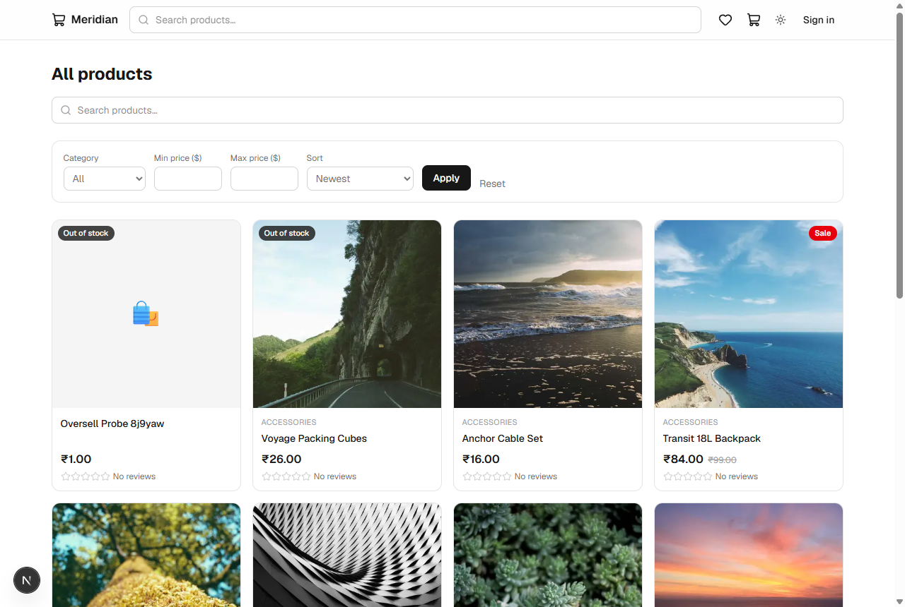 | 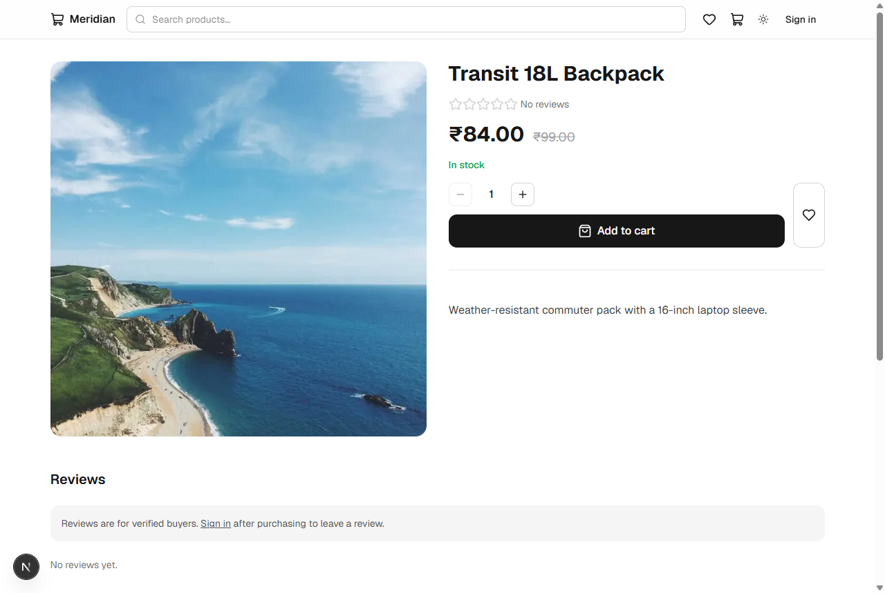 |

**Cart → Checkout**

| Cart | Checkout (address + summary) |
|---|---|
| 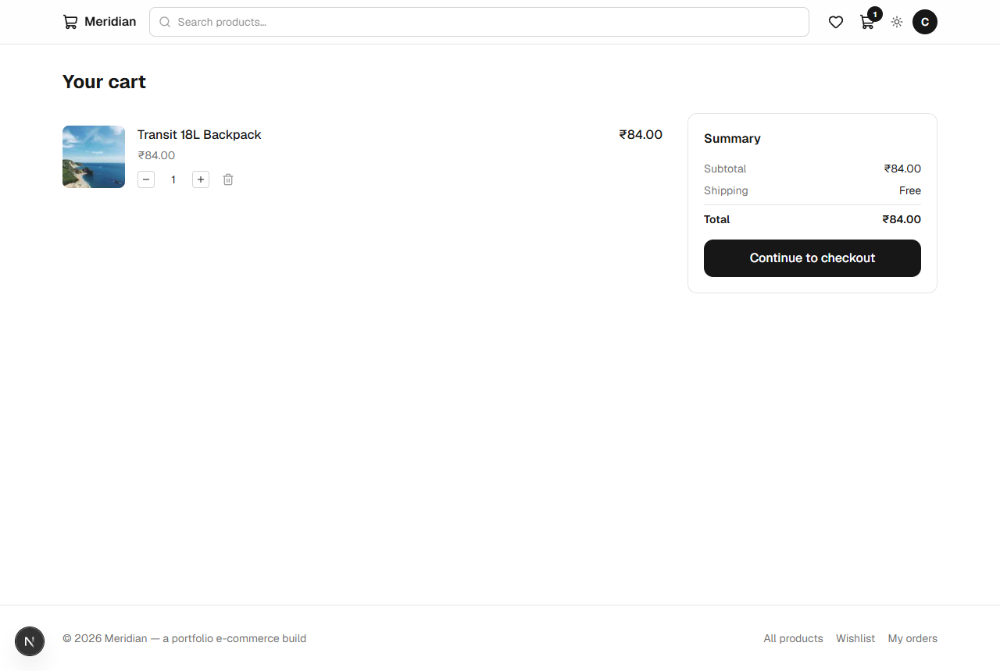 | 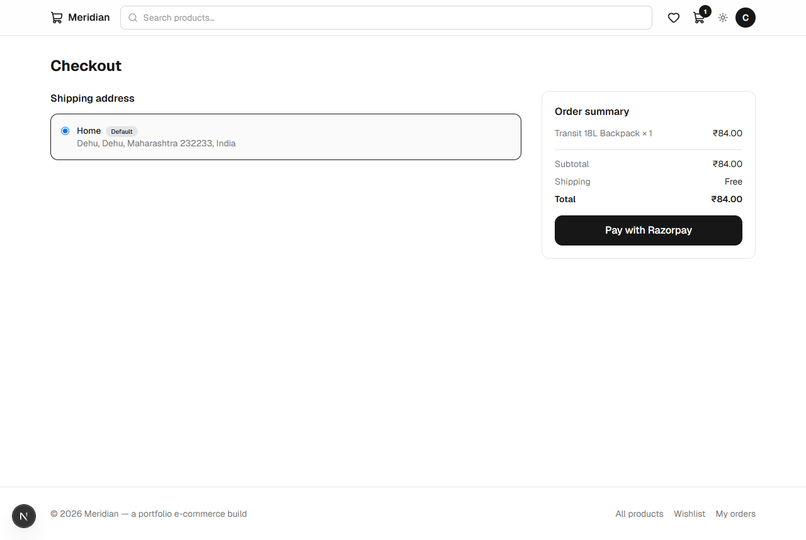 |

**Razorpay Checkout (test mode)**

| Payment options | Card entry | Card details | Bank OTP |
|---|---|---|---|
|  | 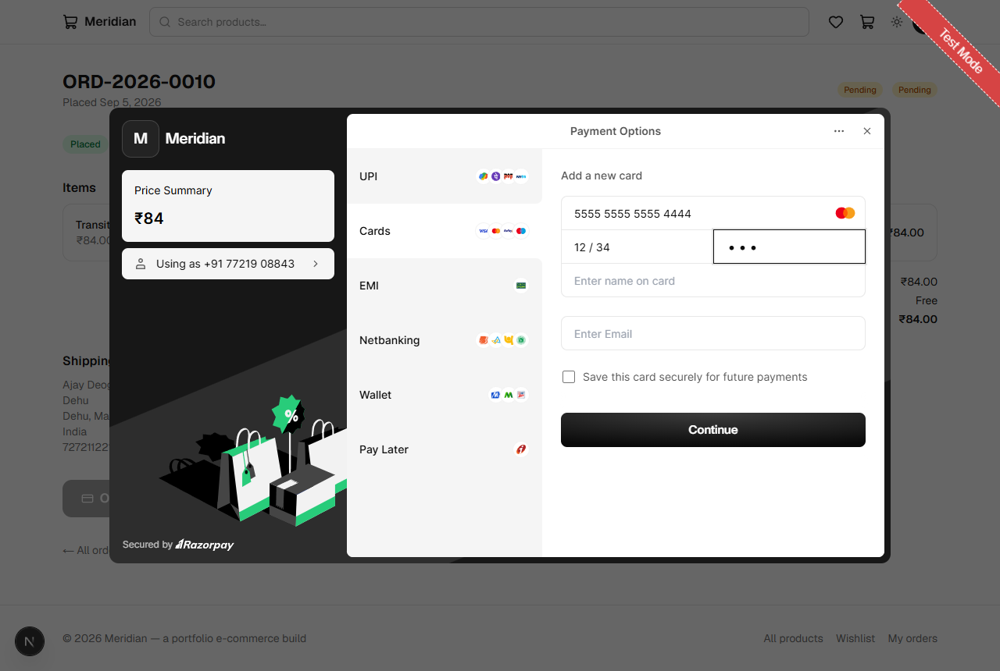 | 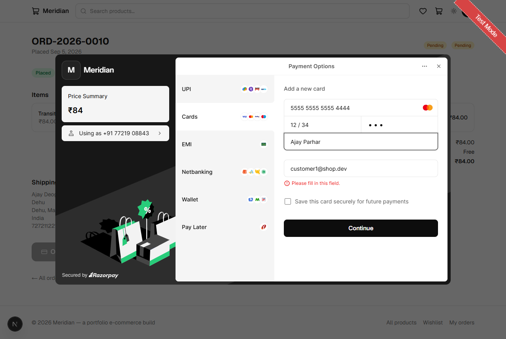 | 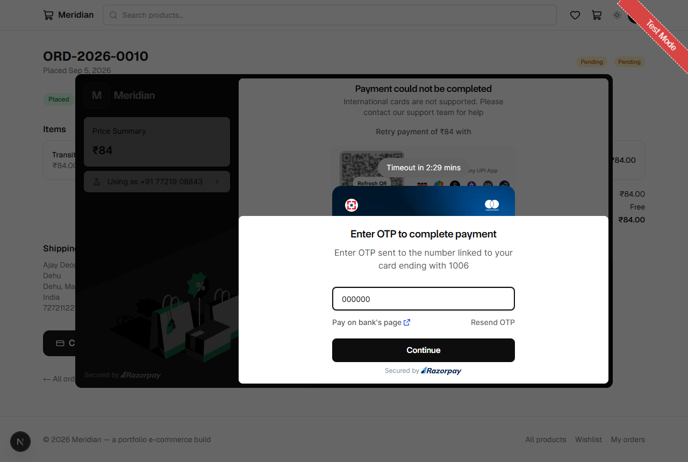 |

**Order lifecycle**

| Order confirmed | Order detail (Paid) | Order history |
|---|---|---|
|  | 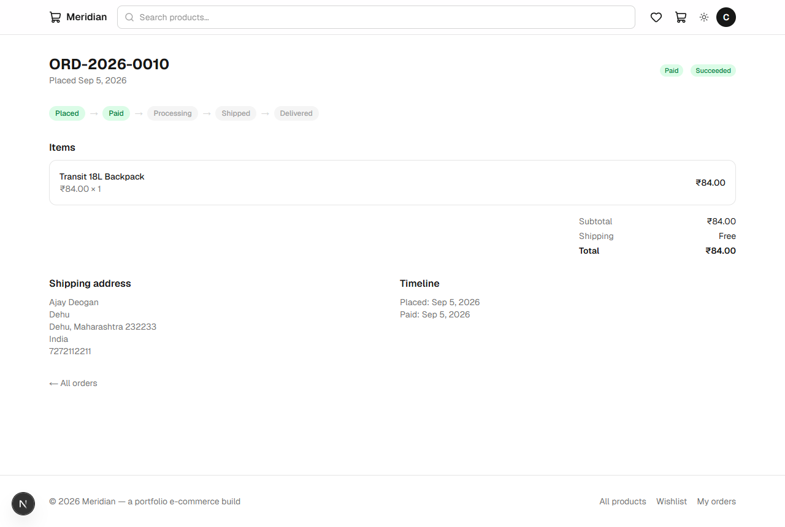 | 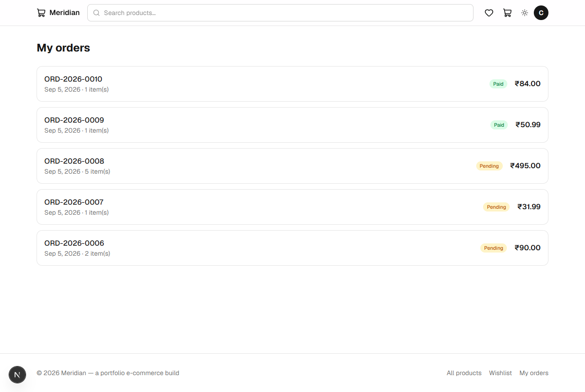 |

**Admin back office**

| Dashboard | Order queue |
|---|---|
|  | 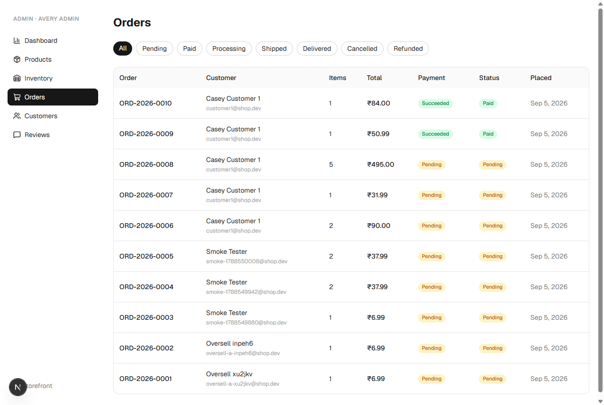 |

## 13. Demo

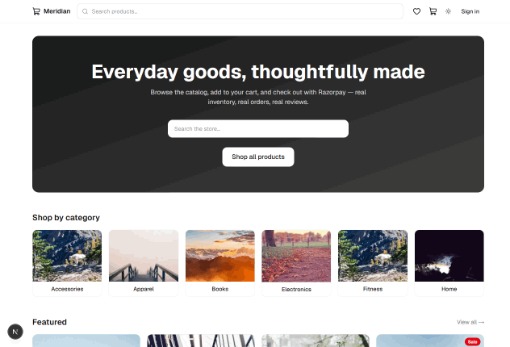

_Full flow: home → product listing → detail → cart → checkout address → pending order →
Razorpay Checkout (UPI / cards) → Mastercard test card `5555 5100 0008 1006` with OTP
`000000` → signature verification marks the order **PAID** → confirmation page →
order timeline → admin dashboard._

## 14. What I Learned

- **Transactions + conditional updates beat read-then-write.** The oversell guard is
  six lines of Prisma (`updateMany` with a `WHERE` on stock) inside a transaction —
  no `SELECT FOR UPDATE`, no advisory locks, and provably correct under concurrency.
- **Webhooks must be idempotent by construction.** Razorpay retries aggressively; the
  claim-first `WebhookEvent` table turns retries into no-ops and makes failed
  processing recoverable (release the claim → the retry reprocesses).
- **Minor-unit money.** One helper (`formatMoney`) at the edge and integer math
  everywhere else — no float bugs, Razorpay-native paise amounts.
- **Snapshots are the audit trail.** `OrderItem` copies name/slug/price; renames and
  repricing never corrupt order history.
- **The status machine is documentation that runs.** Centralizing transitions
  (`assertTransition`) means illegal moves are impossible from both the webhook and
  the admin UI.

## 15. Future Improvements

- Search service (Meilisearch/Typesense) instead of `contains` filters
- In-page Razorpay payment form (razorpay.js embed) instead of the modal, for a
  checkout experience without leaving the page
- Discount codes + multi-currency
- Ship/deliver notification emails
- S3 image pipeline with on-upload resizing
- Order edit/cancellation window pre-fulfillment

## 16. Trade-offs & Design Decisions

| Decision | Trade-off | Why |
|---|---|---|
| Razorpay Standard Checkout (modal) | Less in-page UI control | Minimal PCI scope, tiny webhook surface, fastest to production |
| Price/name snapshots on OrderItem | Duplicated data | Order history is immutable under product edits |
| Conditional `updateMany` stock decrement | Slightly gnarly Prisma code | Correct under concurrency without `SELECT FOR UPDATE` |
| WebhookEvent claim table | Extra table | Idempotency with zero external deps; auditable |
| Guest cart in localStorage | Client-only until sign-in | No anon sessions; merge covers the hand-off |
| Separate `Inventory` model | Extra join | Room for per-variant stock, reservations, audit later |
| Integer paise everywhere | Manual formatting at the edge | No float money bugs, Razorpay-native amounts |
| Archive instead of hard delete products | Stale listings need cleanup | OrderItem/Review FK integrity preserved |
| In-memory rate limiting | Lost on restart, per-instance | Portfolio scale; swap for Redis when multi-instance |

## 17. Scaling Strategy

- **Read path**: Postgres read replicas for the storefront; per-query read-replica routing
- **Write path**: webhook/email processing moves to a queue (SQS/QStash) so the
  request returns immediately; retries become the queue's job
- **Cart/session**: Redis-backed carts + rate limiting once multi-instance
- **Search**: dedicated full-text service with an indexed product feed
- **Inventory**: reservation-based stock (checkout creates a TTL reservation; a reaper
  releases abandoned reservations) instead of decrement-at-checkout
- **Media**: S3 + CloudFront, signed uploads direct from the browser

## Getting Started (local)

```bash
cp .env.example .env          # fill in values (Docker Postgres works out of the box)
docker compose up db -d       # local Postgres on :5433
npm install
npx prisma migrate dev        # create schema
npm run db:seed               # 1 admin + 5 customers + catalog (stock=1 & stock=0 probes)
npm run dev                   # http://localhost:3000
```

**Demo accounts** (password `Password123!`): `admin@shop.dev`,
`customer1@shop.dev` … `customer5@shop.dev`

For the full payment loop locally: grab test keys from the
[Razorpay Dashboard](https://dashboard.razorpay.com/app/keys) (`RAZORPAY_KEY_ID`,
`RAZORPAY_KEY_SECRET`, `NEXT_PUBLIC_RAZORPAY_KEY_ID`), pay with the standard test
instruments (e.g. UPI `success@razorpay`, card `4111 1111 1111 1111`), and — for the
webhook path — add a local tunnel endpoint (e.g. `ngrok http 3000`) pointing to
`/api/webhooks/razorpay` in Dashboard → Settings → Webhooks; copy the generated
secret into `.env` as `RAZORPAY_WEBHOOK_SECRET`.

## Scripts

| Command | Description |
|---|---|
| `npm run dev` / `build` / `start` | Next.js lifecycle |
| `npm run lint` / `type-check` | ESLint / `tsc --noEmit` |
| `npm test` | Vitest unit suite |
| `npm run db:migrate` / `db:deploy` / `db:seed` / `db:reset` | Prisma workflows |
| `node scripts/oversell-test.mjs` | parallel-checkout concurrency test (dev server) |
| `bash scripts/smoke.sh` | end-to-end smoke (dev server) |
| `node scripts/make-demo-gif.mjs` | rebuild `docs/screenshots/demo.gif` from the numbered screenshots |
